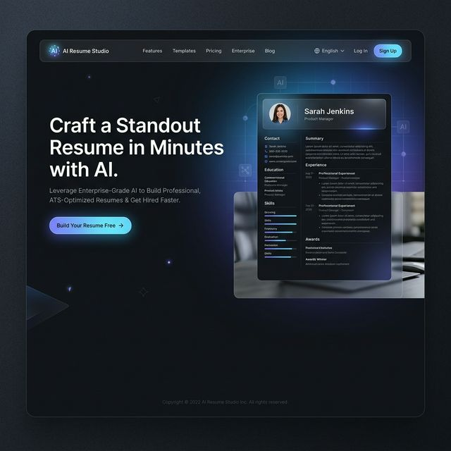
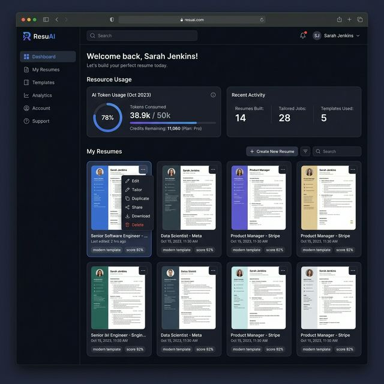

<div align="center">
  

  <h1 align="center">ResumeGPT</h1>

  <p align="center">
    <strong>The Enterprise-Grade, Cloud-Native Resume Builder & ATS Compatibility Analyzer</strong>
    <br />
    Craft standout resumes in minutes utilizing Claude 3 Opus (4.6), premium typography, and real-time semantic scoring.
  </p>

  <p align="center">
    <a href="https://github.com/vanshkhandekar/resumegpt/stargazers"></a>
    <a href="https://github.com/vanshkhandekar/resumegpt/network/members"></a>
    <a href="https://github.com/vanshkhandekar/resumegpt/blob/master/LICENSE"></a>
  </p>
</div>

---

## 📸 Platform Showcase

### 1. High-Converting SaaS Landing Page

*Designed with modern Glassmorphism, tailored for max conversion with a clear academic report section.*

### 2. Centralized Resume Dashboard

*A professional local-synced dashboard tracking usage (Opus 4.6) with enterprise-grade resume cards.*


## 🚀 Core Features

- **Claude 3 Opus 4.6 Integration** — Powered by OpenRouter, our engine analyzes your entire resume payload to generate perfectly tailored, ATS-optimized content.
- **Enterprise-Grade Architecture** — High-performance React/Vite frontend with Shadcn/UI for a premium, lightweight, and fast experience.
- **Local-First Infrastructure** — No login required. Resumes are stored locally in the browser, ensuring maximum privacy and instant access.
- **Dual-Pane Live Preview** — Edit your raw data on the left panel while watching the A4-scaled professional template update instantaneously on the right.
- **Deep Semantic ATS Scoring** — A built-in AI rule-engine measuring keyword density, action-verb usage, quantifiable metrics, and overall structural integrity.

## 🛠️ Technology Stack

| Layer | Technology | Description |
|-------|------------|-------------|
| **Core** | React 18, Vite | High-performance SPA with fast HMR |
| **Logic** | Claude 3 Opus | Advanced AI inference for resume optimization |
| **Integration** | OpenRouter API | Direct, low-latency AI service delivery |
| **UI Ecosystem** | Tailwind CSS, Shadcn/UI | Highly accessible, highly customizable aesthetic |
| **Database** | Local Storage / IndexedDB | Fast, serverless, and privacy-focused persistence |
| **Export Engine** | Custom jsPDF Engine | Precision A4 printing retaining premium UI styling |

## 📂 System Architecture

The repository follows a modern React/Vite structure:

```text
/resumegpt
 ├── /src
 │   ├── /components    # Atomic React components (UI, AI Assistant, Layout)
 │   ├── /pages         # Main views (Landing, Dashboard, ResumeBuilder, Export)
 │   ├── /hooks         # Domain logic (useResumes, handleAI)
 │   ├── /lib           # Core utilities and DemoStorage manager
 │   └── /integrations  # Supabase and External API configurations
 ├── /public            # Global assets, logos, and screenshots
 └── /presentation       # Academic presentation files (PPTX)
```

## 🏁 Quick Start Guide

### 1. Clone & Install
```bash
git clone https://github.com/vanshkhandekar/resumegpt.git
cd resumegpt
npm install
```

### 2. Launch Development
```bash
npm run dev
```

## 🤝 Contributing & Vision

ResumeGPT aims to be the defacto standard for AI-powered career development. We focus on:
1. Addition of new distinct, LaTeX-quality professional templates.
2. Enhancements to our deep semantic ATS rule-engine.
3. Integration with the latest LLM models for even smarter suggestions.

## 📄 License

Distributed under the MIT License. See `LICENSE` for more information.

---
<div align="center">
  <i>Engineered for the Modern Professional. Built by <a href="https://github.com/vanshkhandekar">Vansh Khandekar</a> & Team. (BCA 3rd Year)</i>
</div>
